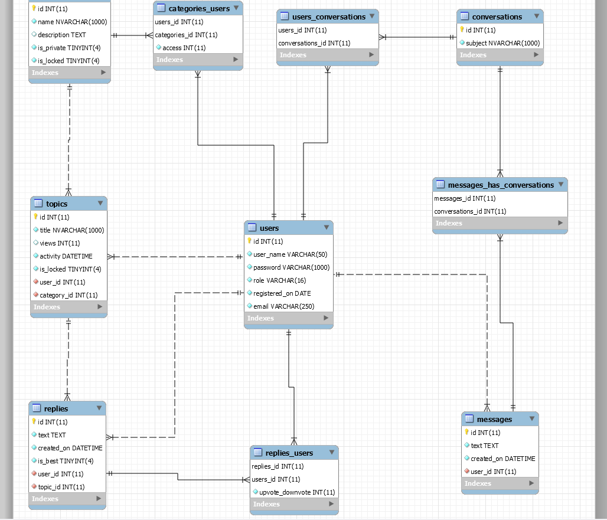

# Forum System API
## Short Descrption
The following Documentation is provided for a Forum system that is designed and implemented by Team 02 from the A40 Alpha Python Cohort.
Provided is a RESTful Api that can be consumed by different clients. For the purpose of presenting how the system functions the different endpoints are accessed by using Postman. For the structure of our application, an N-Tier architecture was selected.

In short, the Forum system lets a user to register, log-in, browse through the different categories that can be accessed by him/her and create topics and reply in them. If the user is an admin, he has other extended privileges, e.g. to grant and revoke accesses for the other users. There is also a direct-messaging service that lets user communicate privately.

## Project Timeline
- Week 1 (19/09 - 25/09) - Ongoing lectures and initial planning - during this period, some substantial learning material had to be taught and absorbed by the team which is paramount to the successful implementation of the project. We had a couple of calls where we went through the description of the tasks and started our initial planning, research and tasks-distribution. We also created the first version of our DB.
- Week 2 (26/09 - 02/10) - Recap, DataBase construction and started writing code - as the material is new to us, we were spending the majority of our time to go back to the lectures, further reading and video recordings. Otherwise, together we finished the overall DB with different tables and relations between them. After some research on the different aspects of the tasks, we started writing up some models and a bit of functionality in the services modules. More detailed thinking of the business logic is done during this period.
- Week 3 (03/10 - 09/10) - Writing up functionality and Unit Testing - during this week most of the code on the backend was written. No unit tests were written, as we were struggling with implementing most of the functionality. At the end of this week we started using Postman to see if our methods were working.
- Week 4 (10/10 - 16/10) - Debugging, refactoring and creating a Python Client - this is the final stage where we were testing if all of our functionality works using Postman as a client and, if needed, make changes to the code. We made some changes, fixed a lot of bugs, added many validations and so on. We were not able to write-up a Python-based client (console client).

## Task-allocation and Team:
Team 02 is comprised of Dimitar, Krasimir and Yasen. After the firs brain-storming sessions and while designing the Database, the team decided to divide the project into four main parts based mainly on table-relations and depending functionality - Users, Categories, Topics and Conversations. This can be seen in the Routers Module in our back-end.

### Responsibilities:
- **Dimitar** - Database design and logic and implementation behind Conversations/Messages.
- **Krasimir** - Unit testing and logic and implementation behind Categories.
- **Yasen** - Overseing of and presenting the project; Logic and implementation behind Users and Topics/Replies.

## Database and Models:
### Database
We are using MariaDB for our database, meaning that it lives locally on each one of our PCs. Whenever a change is made to the database, whether it's the tables with their columns or the chunks of data in them, a new SQL script is exported and uploaded on GIT.

We are using MySQL Workbench for constructing the database and SQL queries are written inside the Services Tier (no ORM).

You can see our DB as tables and their relations here:

### Models
Different Models are present in the Data Tier based on the four main parts of the app and the differ based on when they are used, but are all in the form of Classes inhereting the FastApi Pydantic BaseModel. This is done so that they can be instances that are serialized to and deserialized from JSON strings - thus, being able to be consumed by different clients.

#### Response Models
**NOTE:** Most of the Response Models are such so that we get a better representaion when using Postman. The can be re-written so that the server would respond with data that can be then re-used by the client for other requests.

**BUGS** - The Models can definitely be less than the ones we've got - we might only have main and response ones.

## Main Functionality
### Tokens and Authentication
In the common section, the auth.py file contains methods that are used when Authentication is needed. 
The JWT package was installed so that the tokens can be more secure.
- create_token() - using the JWT package, encodes a user_name to a token string.
- decode_username_from_token() - given a toekn_string, it returns a user_name as string.
- from_token() - using the above method, given a token string, it returns a User Pydantic Object.
- is_authenticated() - Authenticates - checks if a given user_name string is present in the DB.
- get_user_or_raise_401() - uses the above method and if True, it uses from_token() to return a User object. If not, it responds with a 401 Status Code. 

### Users
#### Register User
- Endpoint: http://127.0.0.1:8000/users/register
- Method: **POST**

The request needs a RegisterData object that requires a user_name, a password and an email. The email was added because for a future version, notifications might be sent to users via email. Two validations are made for the length of the user_name and a correctly given email before using the user_service.create() method. The latter will return a User Pydantic Object, only if the user_name has not been used before. If present, the same object is then returned as a response to the request.

#### Login
- Endpoint: http://127.0.0.1:8000/users/login
- Method: **POST**

The request needs a LoginData object that requires a user_name and a password. The first method that is called is try_login - If the user exists and given password is the same as the User's (the passwords in our DB are hashed so the same hash function operates on the given password and the two are compared), it will return a User pydantic object. If, successful, it calls the method from auth.py to create a token and then it returns that token.

#### Give User a Read/Write Access
- Endpoint: http://127.0.0.1:8000/users/{user_name}
- Method: **PUT**

The request needs a Category ID and the new access that needs to be granted in the body - 1 means Read only, 2 means Read/Write. This method needs Admin authentication (a class method for the User Model is called), so in the header, a token needs to be provided, so that we can first authenticate the user and then authorize him/her to change another user's access. Using the user_name and category_id two methods are called from their respective services, to get Pydantic Models. We then validate if the user already has any access to and if the category is private, because access to public ones cannot be changed. Another method is then called which sends an SQL query to the DB and updates the access for the given user and category. If successful, a Success response is returned.
**BUGS** - If the access is changed to the same one, it will still return the successful response, another validation needs to be written for that.

#### Revoke User's Access
- Endpoint: http://127.0.0.1:8000/users/{user_name}
- Method: **DELETE**

The above request to the server is pretty much the same as the previous (above) one, but without providing access. The whole method is the same in terms of validations and responses, only one different function is called and it is remove_user_from_category which sends a DELETE SQL query to the DB and removes the user from the category (more precisely).

### Categories
#### Create Category
- Endpoint: http://127.0.0.1:8000/categories
- Method: **POST**

This request needs a JSON that will be deserialized to a Category Pydantic Object. It needs a name, description (optional) and to say if it's locked (optional, but 0 means unlocked, 1 means locked) and private (0 means public, 1 means private). It again needs admin authentication (token provided in the header again) and if all is well, a function from the category_service is called that creates (inserts into the DB) a new category. A CategoryResponse Model is returned.

**BUGS** Is Locked is not really optional - but the SQL query needs to be changed and also the DB - the default is_locked value to be changed to 0.

#### View All Categories
- Endpoint: http://127.0.0.1:8000/categories
- Method: **GET**

Once more authentication is needed - if the user is admin, a list of all possible categories will be present. If not, only the public ones and the ones the user has access to. The list based on the user can be sorted if there is a query param. If not specified, it will sort by ID.

#### Category by ID
- Endpoint: http://127.0.0.1:8000/categories/{id}
- Method: **GET**

First we authenticate the user requesting this resource. A validation for the existence of the category with the given ID is made and then if the authenticated user has access to this category (for private ones only), if not, a Forbidden response is returned. The method in user_servive.has_access_to_category will return true for all users in the category but also the admin. Lastly we get a CategeoryResponse Model with all the topics for it.

#### Add User to Private Category
- Endpoint: http://127.0.0.1:8000/categories/{id}/users
- Method: **PUT**

In the body of the request we need to provide a user_name that needs to be added to the private category. We need admin authentication - only admin can add other users to a category. We validate the user that is to be added and the category based on the provided information. And if the category is private, we call the method category_service.add_user_to_category which uses a try/except block because it will throw a MariaDB Integrity Error, if the user we try to add is already added. We return a Success Response.

#### View Privileged Users
- Endpoint: http://127.0.0.1:8000/categories/{id}/users
- Method: **GET**

Pretty much the same validations as the above method. If the category is private, we call a function user_service.all_privileged_for_specific_category(category) that sends a READ SQL query to the database and joins the users table with the users_categories one so that we can get a list of tuples containing information about all the users (id and user_name) and their access for the category (WHERE uc.category_id = ?). At the end the server responds with the information about the category and the list with all the users with privileges for it.

#### Make Category Private/Non-Private
- Endpoint: http://127.0.0.1:8000/categories/{id}
- Method: **GET**

Once more the validations and authentications are the same. Otherwise, this method will change the type of category based on her current status - if the category was private, it will become public and vice-versa. If it's the former, there are two functions that are called - one will update the row in the categories table in the DB with the new status, and the other will remove all the users and their access from the many-to-many table users_categories.

### Topics
#### View All Topics
- Endpoint: http://127.0.0.1:8000/topics?sort=asc
- Method: **GET**

This endpoint can be accessed by an admin user only. It is just a list of all possible categories. A user can sort by title of topic and views.

#### Get Topic By Id
- Endpoint: http://127.0.0.1:8000/topics/{id}
- Method: **GET**

The request needs a user token in the header, because authentication is needed. After validating that a topic with such id exists, we get the category for that topic by using get_category_by_id(topic.id) and we need to see if the user has access to this topic (category). If yes, the server responds with a TopicResponseModel which contains a list of replies in the form of ReplyResponse models. 

#### Create Topic
- Endpoint: http://127.0.0.1:8000/topics
- Method: **POST**

Based on the token from the header and category_id provided in the body, we validate the returned user and category. If the category is private and the user does not have access to it, a Forbidden response is returned and also if the user has a read-only access to the category. Otherwise a topic is created, given the information in the body and also the first reply - the text of the topic is the first reply in it. A response model of the topic and the first reply is returned to the client.

#### Lock Topic
- Endpoint: http://127.0.0.1:8000/topics/{id}
- Method: **PUT**

Pretty straightforward. Only admins can lock topics, so we need to authenticate the user and see if he/she is an admin. If the topic is already locked, it cannot be locked again. Otherwise, a function from the topic_service is called which updates the topics table for a given topic_id. Then, a Success response is returned. 

#### Create Reply
- Endpoint: http://127.0.0.1:8000/topics/{id}
- Method: **POST**

As evident, there is no replies.router. This is because the functionality regarding replies is not that much and it can be easily added to the topics.router, plus it makes more sense for the way the endpoints are written. Only the text to be written is provided in the body. After that, the user is authenticated using the token in the headers. If the category of the topic is private, a user can reply only if he/she has write access to it (this is done by two different validations). If a reply can be created, a function from the services tier is called that apart from inserting the information in the DB, it updates the last activity of the whole topic.

#### Upvote/Downvote a Reply
- Endpoint: http://127.0.0.1:8000/topics/{id}/replies{reply_id}
- Method: **PUT**

If the body contains a JSON in the form of {"upvote":1} or downvote instead of upvote, using the good old authentication, the user will like/dislike a given reply in a given topic (see the endpoint). The methods for upvote and downvote are such so that the user cannot like or dislike twice. If he/she has liked and then changes his/her mind and dislikes, the vote will be transferred from the first to the second collection. 

### Choose Best Reply
- Endpoint: http://127.0.0.1:8000/topics/{id}/replies{reply_id}
- Method: **PUT**

It uses the same exact endpoint as the previous method, but it will act differently if the body contains information that the current action is needed. What changes here is that we need to know if user_service.owns_topic(user, topic) because only the OP can choose the best reply.

### Conversations
#### Create Conversation
- Endpoint: http://127.0.0.1:8000/conversations
- Method: **POST**

Analogically to how a topic and first reply are created when a new topic is posted, a new conversation will also insert the first message inside it. The request body needs also a user_name, so that it's known who two people are going to be inserted in the newly created convo - the person writing and the one on the receiving end. This is done by calling an insert func two times after the conversation is created. A conversation response model is then returned to the client.

#### Get Conversation by ID
- Endpoint: http://127.0.0.1:8000/conversations/{id}
- Method: **GET**

The person who has just created the conversation and the one who received the first message in it from the above method, can now access the it by id. That is why authentication is needed and an admin can see it only, if he is in the conversation (privacy!). A response model is returned.

#### Reply in Conversation
- Endpoint: http://127.0.0.1:8000/conversations/{id}
- Method: **POST**

Authentication needed so that it is validated if the user has access to the conversation with the given id. If, yes, a new message is created and a response model of the whole conversation is returned.

#### Conversations for User
- Endpoint: http://127.0.0.1:8000/conversations
- Method: **GET**

This responds with a list with all the conversations - their id, subject and the other person in them that a person has access to. Here, a function from the services tier is used that sends a READ SQL query to the DB which is a bit complex. However, it saves a lot of other code and it is a principle that cacn be used potentially if refactoring of the whole app is to be done.

## Note to Future-Selves
For future projects, a better planning will be needed, which will be possible, because both the WEB-part and the DATABASE-part were new to the team. More learning needs to be done and with practice, everything will be better. Unit-testing lacks this time again, as mainly one person on the Team deals with it. For our next project, tests will be written by everyone as we write-up all the methods (we understand the importance of good-quality unit-testing!). 
The tasks need to be allocated accordingly and the use of a task-management system will have to be implemented more extensively.

## Note to Trainers
Thank you once more for all the knowledge you've shared with and all the support you provided us!